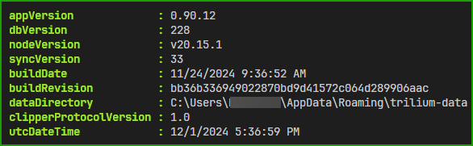

# Trilium PowerShell Module<!-- omit in toc -->

## Table of Contents<!-- omit in toc -->
- [Overview](#overview)
- [Installation](#installation)
- [Authentication](#authentication)
- [Commands](#commands)
- [Connect-TriliumAuth](#connect-triliumauth)
    - [Examples](#examples)
- [Disconnect-TriliumAuth](#disconnect-triliumauth)
  - [Examples](#examples-1)
- [Get-TriliumInfo](#get-triliuminfo)
    - [Examples](#examples-2)
- [Get-TriliumRootNote](#get-triliumrootnote)
  - [Examples](#examples-3)
- [Find-TriliumNote](#find-triliumnote)
  - [Examples](#examples-4)
  - [Parameters](#parameters)
- [Get-TriliumNoteDetails](#get-triliumnotedetails)
- [Export-TriliumNote](#export-triliumnote)
- [New-TriliumNote](#new-triliumnote)
- [Remove-TriliumNote](#remove-triliumnote)
- [Get-TriliumNoteContent](#get-triliumnotecontent)
- [Set-TriliumNoteContent](#set-triliumnotecontent)
- [Import-TriliumNoteZip](#import-triliumnotezip)
- [New-TriliumNoteRevision](#new-triliumnoterevision)
- [Copy-TriliumNote](#copy-triliumnote)
- [Get-TriliumBranch](#get-triliumbranch)
- [Remove-TriliumBranch](#remove-triliumbranch)
- [New-TriliumBackup](#new-triliumbackup)
- [Get-TriliumAttribute](#get-triliumattribute)
- [Remove-TriliumAttribute](#remove-triliumattribute)
- [Update-TriliumNoteOrder](#update-triliumnoteorder)

## Overview

This PowerShell module provides a set of functions to interact with a TriliumNext instance via its ETAPI. It allows you to authenticate, manage notes, and perform various operations on your TriliumNext instance.

To get more help with any cmdlet run below and subsitute cmdlet name as needed:
```powershell
help Connect-TriliumAuth
```

[TriliumNext](https://github.com/TriliumNext/Notes)\
[ETAPI Docs](https://github.com/zadam/trilium/wiki/ETAPI)\
[ETAPI OpenAPI format](https://github.com/zadam/trilium/blob/master/src/etapi/etapi.openapi.yaml)

## Installation
https://www.powershellgallery.com/packages/Trilium/

```powershell
# Example installation command
Install-Module -Name Trilium -Scope CurrentUser
```

## Authentication

Before using any other functions, you need to set up authentication with your TriliumNext instance using [Connect-TriliumAuth](#connect-triliumauth)

## Commands

## Connect-TriliumAuth
Sets the authentication to a Trilium instance for API calls.
> :memo: **Notes:**
> - Only need to use Auth parameter only or Password parameter only or ETAPITOKEN parameter only
>   - Auth parameter is for better security using masked input after the command runs.  Uses a swtich, ETAPITOKEN or PASSWORD
>   - ETAPITOKEN parameter uses plain text and best for automation
>   - Password parameter uses plain text and best for automation.
> - BaseUrl paramter should be base url inclusing port:  'http://localhost:8082'
> - BaseUrl can include port when using a reverse proxy:  'https://trilium.myDomain.com'
> - :exclamation: 4 options below to login, use ONLY 1 that works best for you.

#### Examples
```powershell
# Option 1
# This command will ask for the ETAPITOKEN using a masked input for better security.
Connect-TriliumAuth -BaseUrl 'https://trilium.MyDomain.com' -Auth ETAPITOKEN

# Option 2
# This command will ask for the password using a masked input  for better security
Connect-TriliumAuth -BaseUrl 'https://trilium.domain.com' -Auth Password

# Option 3
# This command will allow you to supply the ETAPITOKEN in plain text, no extra input.
Connect-TriliumAuth -BaseUrl 'https://trilium.domain.com' -EtapiToken myEtapiTokenstring

# Option 4
# This command will allow you to supply the password in plain text, no extra input.
Connect-TriliumAuth -BaseUrl 'https://trilium.domain.com' -Password myPassword
```
Successfull connection should display TriliumNext details.



## Disconnect-TriliumAuth

Removes the authentication from TriliumNext instance if using a password.  Also removes local variable.

### Examples
```powershell
Disconnect-TriliumAuth
```

## Get-TriliumInfo
Gets the application info for Trilium
#### Examples
```powershell
Get-TriliumInfo
```
Output


## Get-TriliumRootNote
Gets the root note details from the Trilium instance.
### Examples
```powershell
Get-TriliumRootNote
```
Output


## Find-TriliumNote
Finds a Trilium note based on search criteria.
### Examples
```powershell
# Simple text based search, searches everything.
Find-TriliumNote -Search 'TestNote'

# Finds anything with 'textnote' and includes a 'iconClass' label
Find-TriliumNote -Search 'testnote' -Label 'iconClass'
```
### Parameters
- Search: The search term.
- Label: Optional label to filter search.
- FastSearch: Option for fast search.
- IncludeArchivedNotes: Option to include archived notes.
- DebugOn: Option to enable debug mode.
- NoteId: Optional note ID to search within.
- Limit: Limits search to certain number.  OrderBy is required.
- OrderBy: Orders by values:  
  - "title", "publicationDate", "isProtected", "isArchived", "dateCreated", "dateModified", "utcDateCreated", "utcDateModified", "parentCount", "childrenCount", "attributeCount", "labelCount", "ownedLabelCount", "relationCount", "ownedRelationCount", "relationCountIncludingLinks", "ownedRelationCountIncludingLinks", "targetRelationCount", "targetRelationCountIncludingLinks", "contentSize", "contentAndAttachmentsSize", "contentAndAttachmentsAndRevisionsSize", "revisionCount"

## Get-TriliumNoteDetails

Gets details of a specific Trilium note.

## Export-TriliumNote

Exports a Trilium note to a zip file.

## New-TriliumNote

Creates a new Trilium note.

## Remove-TriliumNote

Removes a Trilium note.

## Get-TriliumNoteContent

Gets the content of a specific Trilium note.

## Set-TriliumNoteContent

Sets the content of a specific Trilium note.

## Import-TriliumNoteZip

Imports a Trilium note zip file to a specific Trilium note.

## New-TriliumNoteRevision

Creates a new revision for a specific Trilium note.

## Copy-TriliumNote

Creates a clone (branch) of a Trilium note in another note.

## Get-TriliumBranch

Gets details of a specific Trilium branch.

## Remove-TriliumBranch

Removes a specific Trilium branch.

## New-TriliumBackup

Creates a new backup for a specific Trilium instance.

## Get-TriliumAttribute

Gets details of a specific Trilium attribute.

## Remove-TriliumAttribute

Removes a specific Trilium attribute.

## Update-TriliumNoteOrder

Updates the order of notes under a specific parent note.